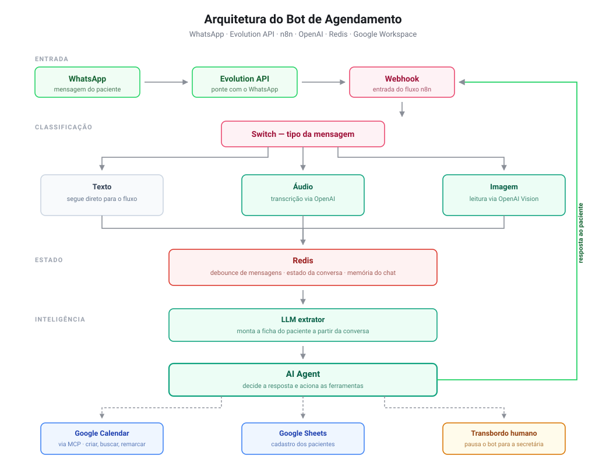

# Bot de Agendamento por WhatsApp

Automação de atendimento e agendamento de consultas via WhatsApp, com interpretação de linguagem natural, leitura de áudio e imagem, e criação automática do evento no Google Agenda.

Esta é a versão genérica e open source de uma solução que desenvolvi para uma clínica de oftalmologia, hoje em operação realizando de 3 a 9 agendamentos por dia sem intervenção manual.

---

## O problema

Consultórios pequenos gastam boa parte do expediente da recepção respondendo as mesmas perguntas no WhatsApp e marcando consultas manualmente. Cada mensagem parada é um paciente esperando — e cada agendamento anotado à mão é uma chance de erro na agenda.

A ideia aqui não é substituir a secretária, e sim tirar dela a parte repetitiva: identificar o paciente, coletar os dados, oferecer horário e registrar. O que foge do padrão continua indo para uma pessoa.

---

## Arquitetura

| Componente | Função |
|---|---|
| **Evolution API** | Ponte com o WhatsApp: recebe e envia mensagens |
| **n8n** | Orquestra todo o fluxo |
| **OpenAI** | Interpreta a conversa, transcreve áudios e lê imagens |
| **Redis** | Debounce de mensagens, estado da conversa e memória do chat |
| **Google Calendar** | Agenda, consulta e remarca as consultas (via MCP) |
| **Google Sheets** | Cadastro dos pacientes |

---

## O que este fluxo resolve

**Aceita texto, áudio e imagem.** Um switch identifica o tipo da mensagem. Áudio passa por transcrição, imagem passa por análise de visão, e ambos entram no mesmo fluxo do texto. O paciente manda um áudio dizendo o que precisa e o bot entende.

**Agrupa mensagens picotadas.** Quase ninguém escreve tudo numa mensagem só — a pessoa manda "oi", depois "queria marcar", depois "uma consulta". Um debounce com Redis e um nó de espera junta essas mensagens antes de acionar a IA, evitando três respostas desencontradas.

**Mantém o estado da conversa.** Um LLM extrator lê cada mensagem e vai preenchendo uma ficha do paciente (nome, data de nascimento, unidade). O agente só avança para o agendamento quando a ficha está completa, e faz uma pergunta de cada vez.

**Evita agendamento em duplicidade.** Antes de oferecer horários, o agente busca no calendário se aquele telefone já tem consulta futura marcada. Se tiver, informa a data existente e oferece manter, cancelar ou remarcar.

**Sabe quando parar.** Se o paciente pede para falar com um humano, se irrita, ou pergunta algo fora do escopo, o agente aciona uma tool que pausa o bot para aquele contato e passa o atendimento para a secretária.

---

## O agente e suas ferramentas

O AI Agent tem acesso ao modelo de linguagem, à memória da conversa no Redis e às ferramentas de calendário expostas via MCP — criar, buscar, listar, atualizar e excluir eventos — além da tool de transbordo para atendimento humano.

---

## Integração com o Google Agenda

Cada agendamento confirmado na conversa vira um evento no calendário, respeitando os dias e horários de atendimento configurados.

---

## Como usar

**Pré-requisitos:** uma instância do n8n, uma instância da Evolution API conectada a um número de WhatsApp, um Redis acessível, uma conta na OpenAI com créditos, e uma conta Google.

1. Importe `agendamento-bot.json` na sua instância do n8n
2. Configure as credenciais: OpenAI, Redis, Evolution API, Google Sheets e Google Calendar
3. Substitua os placeholders do workflow:
   - `SEU_GOOGLE_SHEETS_ID` — ID da planilha de cadastro
   - `sua-agenda@exemplo.com` — ID do calendário
   - `seu-n8n.exemplo.com` — domínio da sua instância, no nó MCP Client
   - `SEU_WEBHOOK_PATH` — caminho do webhook
4. No nó **AI Agent**, preencha o prompt com o contexto do seu negócio: `{{NOME_DA_CLINICA}}`, `{{VALOR_DA_CONSULTA}}`, `{{DIAS_E_HORARIOS}}` e `{{DURACAO_DA_CONSULTA}}`
5. Crie uma planilha no Google Sheets com as colunas usadas no cadastro
6. Aponte o webhook da Evolution API para a URL do webhook do n8n
7. Ative o workflow

---

## Limitações conhecidas

- O prompt precisa ser adaptado para cada negócio — não funciona genérico de fábrica
- Não valida convênio nem formas de pagamento
- Depende da instância da Evolution API estar de pé; se ela cair, nenhuma mensagem chega ao fluxo
- A IA pode interpretar errado mensagens muito ambíguas, e nesses casos o transbordo para humano é o caminho
- Foi construído para uma agenda com horários fixos; agendas com regras complexas exigem ajustes na lógica

---

## Aviso

Este repositório contém apenas a estrutura do fluxo, com todos os dados sensíveis substituídos por placeholders. Nenhuma credencial, dado de paciente ou informação de cliente está incluída.

Se for adaptar para uso com dados de saúde, atente-se à LGPD: dados de pacientes são dados sensíveis e exigem cuidado com armazenamento, acesso e retenção.

---

## Licença

MIT — veja [LICENSE](LICENSE).

---

Desenvolvido por [Levi Costa](https://github.com/levicostaq) · [LinkedIn](https://linkedin.com/in/levicostaq)
